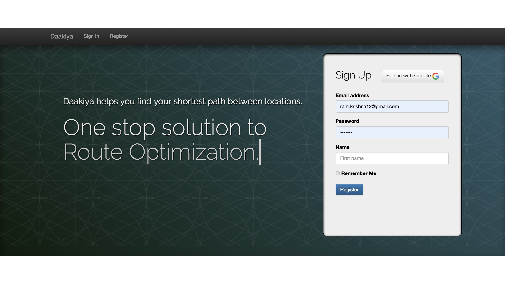
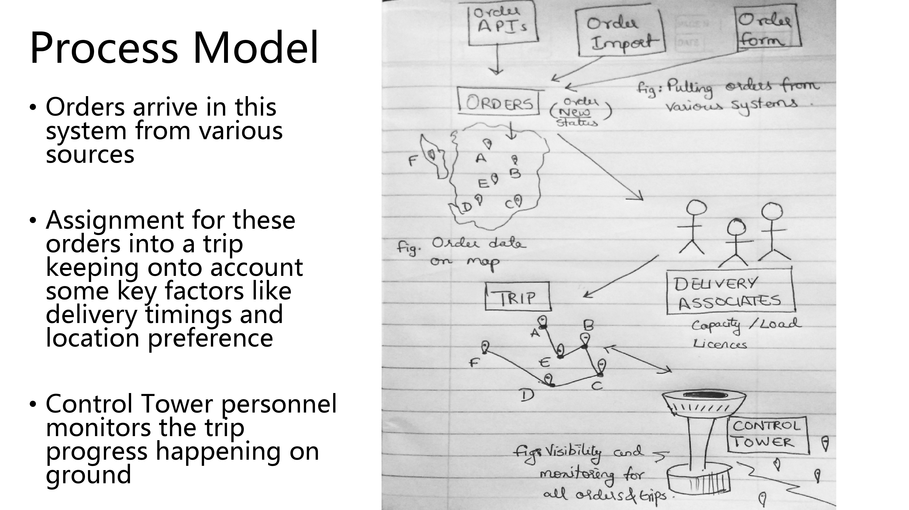
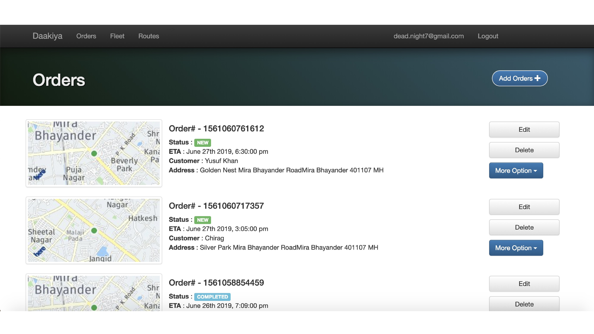
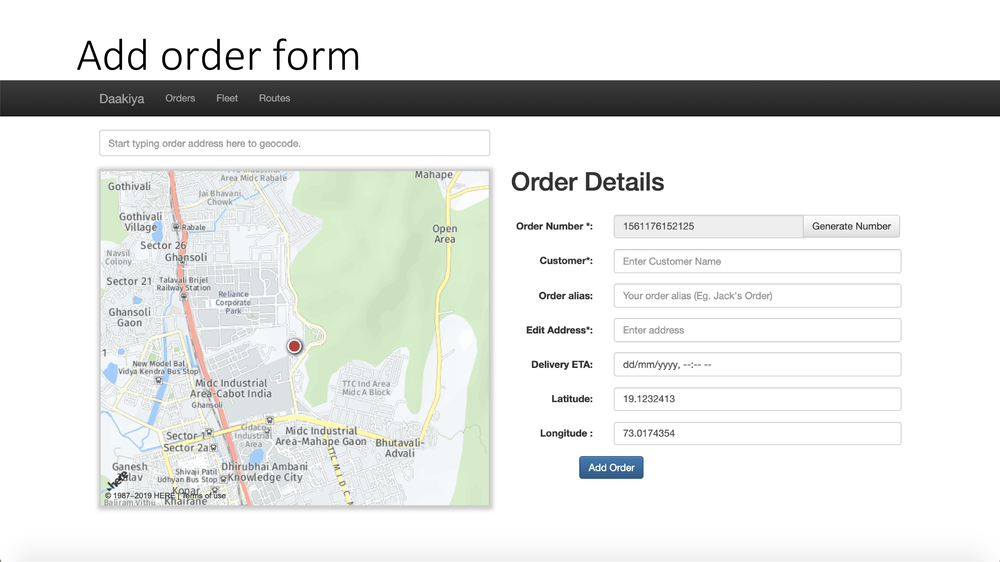
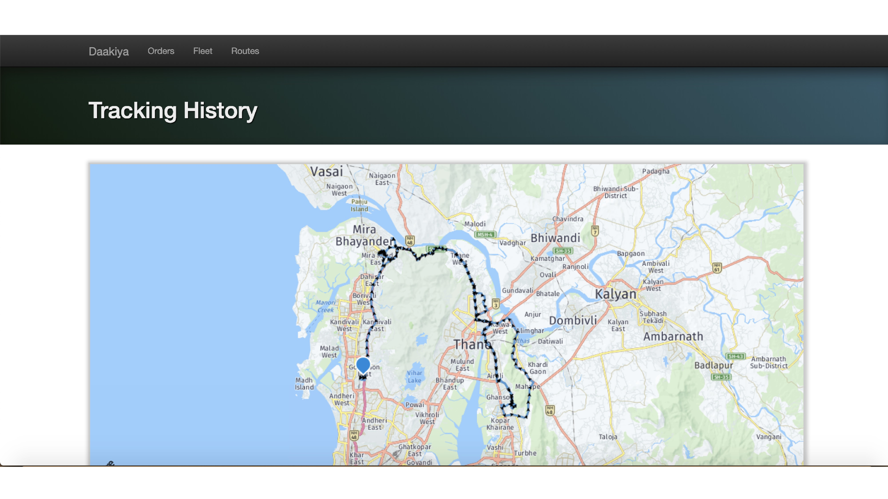
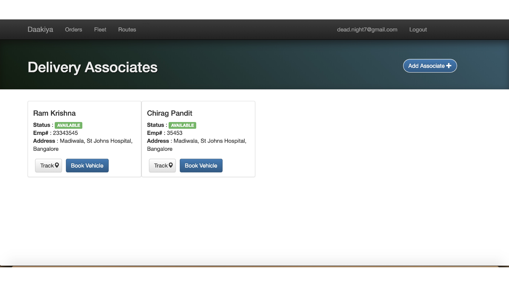
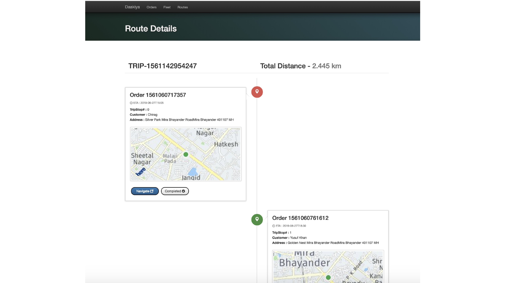
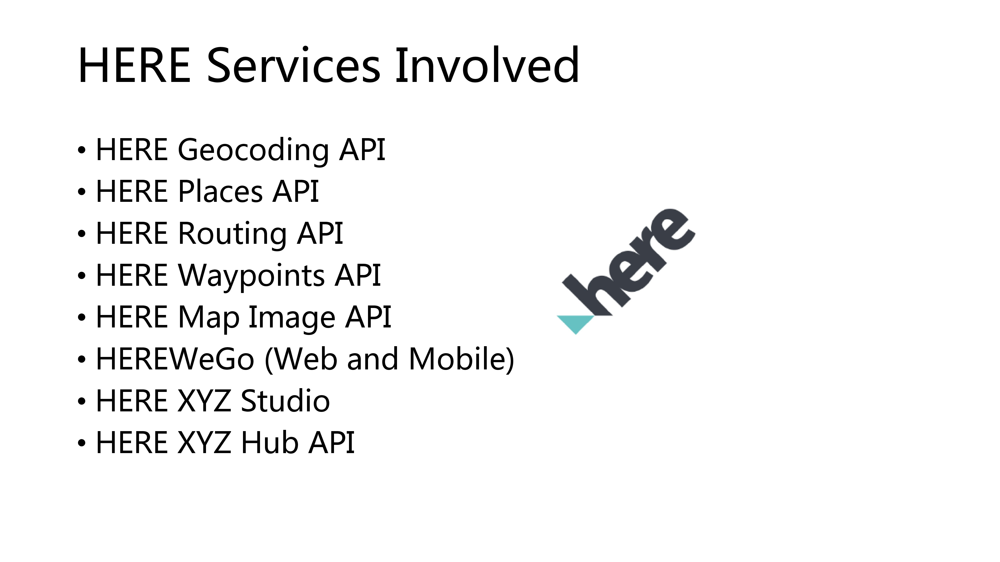

# Daakiya (डाकिया)

Route Optimization, Planning and Management for Last Mile Trips

### Features
- Add orders via order add form
- Track your delivery associates 
- Create an optimized trip for Last Mile Delivery including the series of stops which a delivery associate can undergo.
- Assign vehicles to delivery associate from a list of vehicles present in the inventory.
- Share the route created with the delivery associate via prints or online for delivery fulfillment.

### Development
- Clone the Project git clone <url>
- Navigate into that project root folder
- Edit your HERE access token keys app_id and app_code by getting your access from HERE Developer console
- Edit your Firebase access tokens by getting your details from Firebase Console
- On macs; run `python -m SimpleHTTPServer 7000` to start development server 
- Goto http://localhost:7000 to check your application is deployed

### Deployments
- Firebase login
- Assign access 
- Firebase deploy

### Acknowledgement
This project heavily uses Location APIs endpoints provided by HERE Technologies with hosting and database in Google Firebase. 
It heavily compliments the use of various Developer APIs including Routing, Geocoding, Places, Transit, Waypoints, Interactive Maps Javascript, HERE Tracking, HERE XYZ Studio, HERE XYZ Hub and HERE We Go (Web and Mobile). 
You can get an access to HERE
freemium developer offering from HERE at https://developer.here.com/ to try it out.

Along with getting an access to HERE Location APIs, you will also have to have a project in Firebase, Go to https://console.firebase.google.com for getting an access.

I am really thankful to HERE Technologies and Google Firebase and Browserstack to provide me with their infra for accomplishing this project. 

### Testing Partners

### Licence
Project is [MIT licensed](./LICENSE).

### Screens 

 

 

  
